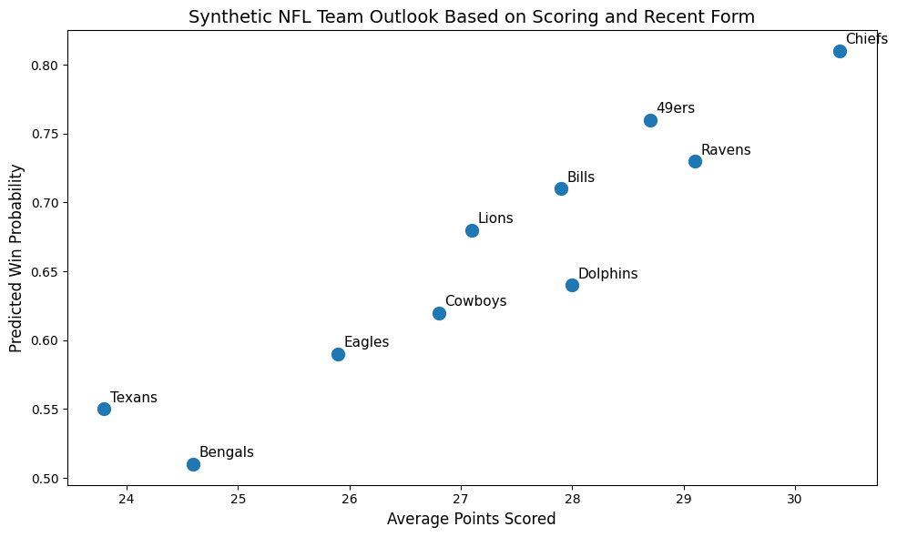

# **Predicting NFL Game Outcomes Using Structured Game Data**

## Picking a winner in an NFL game usually comes down to gut feeling, a few stats, or recent performance. But when you step back, each game is shaped by a combination of factors that are rarely considered all at once.

Predicting the outcome of a sports game is not straightforward because performance depends on multiple interacting variables, such as scoring ability, defensive strength, and recent trends. Looking at one or two statistics often gives an incomplete picture of a matchup.

In many datasets, this information is also spread across separate tables or files, which makes it harder to analyze a game as a single unit. This creates a gap between the available data and how people actually think about matchups.

## Solution 

To address this, I constructed a secondary dataset (D1) using the document model, where each document represents a single NFL game. Instead of separating teams and statistics, each game document includes key information for both teams, such as average points scored, win percentage, and recent performance leading into the matchup.

By organizing the data this way, each game becomes a self-contained unit that captures the full context of the matchup. This structure makes it easier to compare teams and supports predicting whether the home or away team is more likely to win.

## Visual

The chart below compares predicted outcomes based on team performance metrics. It highlights how differences in scoring and recent performance can influence the likelihood of a team winning. By bringing these factors together in a single view, the visualization shows how structured data can improve understanding of game outcomes.

